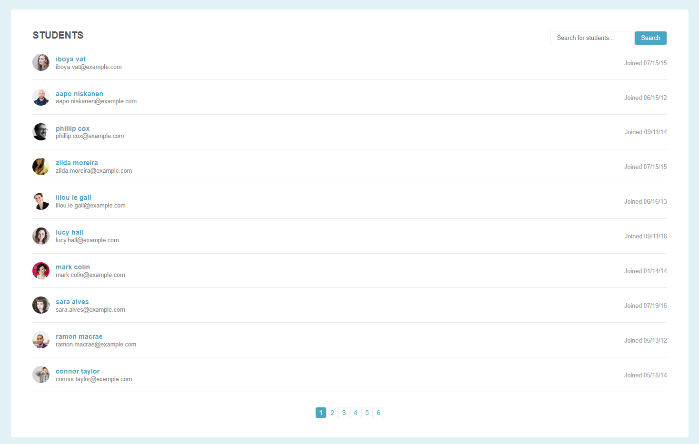

# Paginating and Filtering 
## TechDegreeProject2

### Summary:
This project uses JavaScript to paginate and filter a long list on the page load and also based on the user's input and actions.  
Paginating and filtering ultimately creates a better user experience as users don't have to scroll through long lists to find the content they need.  

This project also makes use of progressive enhancement - none of the Javasript is contained in the HTML file.  Therefore, the webpage is not depedent on JavaScript;  the JavaScript merely enhances the user experience.  

The project was created for partial fulfillment in my pursuit of the FullStack Javascript Techdegree from Team Treehouse.

Sample Screenshot

### Features:

* Dynamically creates navigation links corresponding to the length of list and page display limit, which I set to 10. This code will work for any list length
* After clicking a link the list is filtered to show only the students that fall within a given range
* A search bar also dynamically filters the list in response to user's key strokes or copying and pasting content in the search bar and hitting the search button
* No results found message is displayed if no students match the search string

### Languages:
* **JavaScript**: The Javascript is vanilla Javascript and does not use any frameworks or jQuery.  The JavaScript was written entirely by me.
* **HTML & CSS**: The HTML and CSS was provided by Treehouse.  

### Installing:

* Download or clone repo to your computer
* Navigate to the folder structure
* Click on index.html to demo
* File should load into your browser for you to use
* Feel free to make modifications to the original files and use to suit your own purposes

## Authors

* **Brandon L. Branch** - Authored Javascript 
* **Team Treehouse** - Provided starter HTML & CSS
